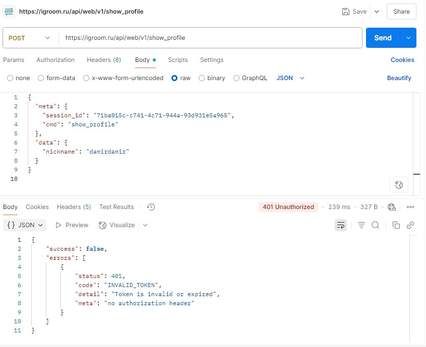

## Как пользоваться сайтом

После запуска проекта (`npm run dev`) в браузере доступны 2 маршрута:

- `http://localhost:5173/me` — страница **своего профиля**, сверстана по левой части макета из фигмы
- `http://localhost:5173/other` — страница **другого пользователя**, на основе `mock/otherProfile.json`

На главной (`/`) есть ссылки на эти страницы для удобства.

## Почему кнопка "Выйти из профиля" не такая, как в макете?

Мне показалось, что версия с текстом и иконкой по центру выглядит лучше, т.к. это отдельный блок по макету.

## Почему используется mock и откуда данные в виде ToDo на странице /other?

Я пытался отправить реальный запрос через Postman с тестовым session_id, как указано в условии тестового задания:

```
POST https://igroom.ru/api/web/v1/show_profile
Content-Type: application/json

{
  "meta": {
    "session_id": "71ba015c-c741-4c71-944a-93d931e5a965",
    "cmd": "show_profile"
  },
  "data": {
    "nickname": "damirdamir"
  }
}
```

### Ответ от API:
```json
{
  "success": false,
  "errors": [
    {
      "status": 401,
      "code": "INVALID_TOKEN",
      "detail": "Token is invalid or expired",
      "meta": "no authorization header"
    }
  ]
}
```



Из-за этого было принято решение использовать локальный mock-файл `mock/otherProfile.json`, в который скопирован полный JSON-ответ из условия задания (Запрос (1)). Я работал с ним через `useEffect` и `setData` в компоненте `OtherProfile.jsx`.

В Запрос (1) данные неполные, точнее обозначены как ToDo, собственно я их обработал и так же и отобразил.

## Ответ из Запрос (1)

{
    "success": true,
    "data": {
        "page": {
            "image": "https://s3.twcstorage.ru/b90dcef9-3a3d4aa5-390c-43f7-8b10-e5e0bbf5eccf/images/profile/avatars/default/new/13.png",
            "title": "Дамир",
            "subtitle": null,
            "left": [
                {
                    "button": {
                        "name": "",
                        "cmd": "show_back",
                        "icon": "todo.svg"
                    }
                }
            ],
            "middle": [
                {
                    "group": [
                        {
                            "label": {
                                "text": "damirdamir"
                            }
                        },
                        {
                            "label": {
                                "text": "16 мая"
                            }
                        }
                    ]
                },
                {
                    "group": [
                        {
                            "label": {
                                "text": "18 дней"
                            }
                        },
                        {
                            "label": {
                                "text": "(todo)"
                            }
                        },
                        {
                            "label": {
                                "text": "(todo)"
                            }
                        }
                    ]
                },
                {
                    "group": [
                        {
                            "label": {
                                "text": "Краснодар"
                            }
                        },
                        {
                            "label": {
                                "text": "РУМИТЬ"
                            }
                        }
                    ]
                },
                {
                    "group": [
                        {
                            "label": {
                                "text": "",
                                "icon": "todo.svg"
                            }
                        }
                    ]
                },
                {
                    "group": [
                        {
                            "label": {
                                "text": "Поместить в черный список",
                                "icon": "todo.svg"
                            }
                        }
                    ]
                }
            ],
            "right": [
                {
                    "button": {
                        "name": "",
                        "cmd": "make_share",
                        "icon": "todo.svg"
                    }
                }
            ]
        }
    },
    "meta": {
        "session_id": "71ba015c-c741-4c71-944a-93d931e5a965",
        "cmd": "show_profile"
    }
}


